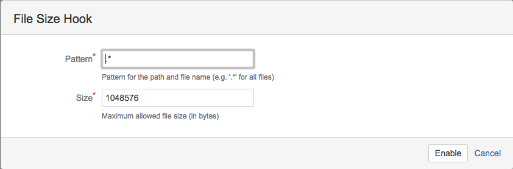

# Introduction
An Atlassian Stash plugin to check on various file attributes, like size, name.

# Installation
The plugin is available in the [Atlassian Marketplace](https://marketplace.atlassian.com/) and can be installed directly in Stash using the Universal Plugin Manager (UPM).

# Configuration
## File Size Hook
In order to configure the hook go to your repository and select **Settings** -> **Hooks** -> **File Size Hook**.
The following example rejects all files larger then 1MB (1048576 bytes).

# Releases

1.0.0 (2015-01-XX)

* Reject commits containing files which exceed a configurable file size. Files can be identified by regular expressions.

# Roadmap
* Reject commits containing files which match a regular expression.
* Allow different file size limits for different files.