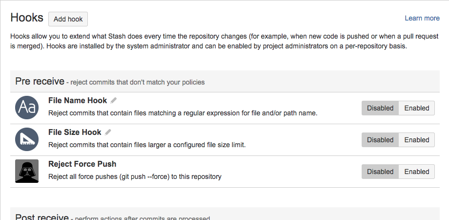
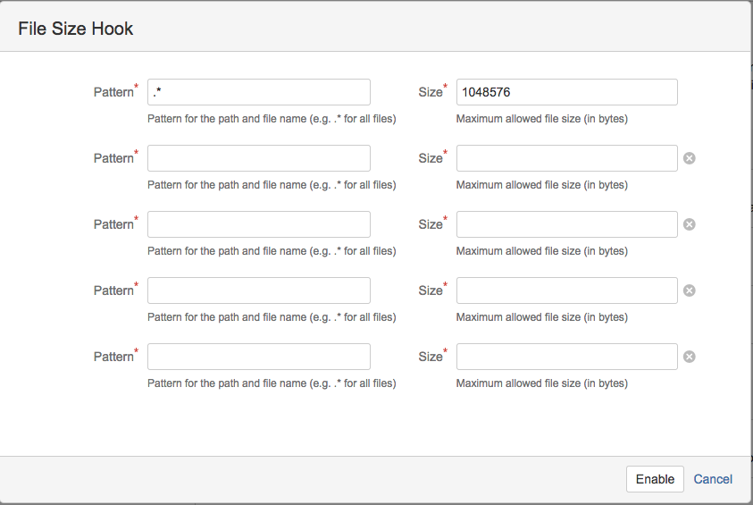
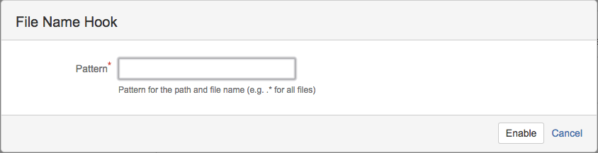

# Introduction
An Atlassian Bitbucket Server plugin to check on various file attributes, like size, name.



# Installation
The plugin is available in the [Atlassian Marketplace](https://marketplace.atlassian.com/plugins/org.christiangalsterer.stash-filehooks-plugin) and can be installed directly in Bitbucket Server using the Universal Plugin Manager (UPM), see [here](https://marketplace.atlassian.com/plugins/org.christiangalsterer.stash-filehooks-plugin#tabs-installation) for details.

# Configuration
## File Size Hook
In order to configure the hook go to your repository and select **Settings** -> **Hooks** -> **File Size Hook**.
The following example rejects all files larger then 1MB (1048576 bytes).



## File Name Hook
In order to configure the hook go to your repository and select **Settings** -> **Hooks** -> **File Name Hook**.
The following example rejects all files matching the pattern **readme.md** when the file is pushed or part of a merge request(pull request).



# Releases

2.4.0 (2016-09-09)

* File Name Hook:
  * Checks the file name pattern also for merge requests(pull requests) and not only for pushes, thanks [ellaz](https://github.com/ellaz)to providing the pull request.

2.3.1 (2016-08-31)

* Fixes an issue with rollback commits and forced pushed to Bitbucket, thanks [ar613](https://github.com/ar613) for providing a fix.

2.3.0 (2016-03-15)

* Allows to specify branch name patterns for the File Size Hook and File Name Hook.

2.2.0 (2016-01-23)

* Tag commits are now excluded

2.1.2 (2016-01-22)

* File Size Hook:
  * Fixes: [Deleted files were not excluded from check](https://github.com/christiangalsterer/stash-filehooks-plugin/issues/11)
* File Name Hook:
  * Fixes: [Deleted files were not excluded from check](https://github.com/christiangalsterer/stash-filehooks-plugin/issues/11)

2.1.1 (2015-10-18)

* Allows to specify exclude patterns for the File Size Hook and File Name Hook.

2.1.0 (2015-10-18)

* Allows to specify exclude patterns for the File Size Hook and File Name Hook.

2.0.0 (2015-09-29)

* Compatibility with Bitbucket Server 4.0.x

1.1.0 (2015-03-15)

* File Size Hook:
  * Allows now to specify up to 5 different pattern and size combinations.
  * Fixes: [Plugin crashes when pushing a branch delete #2](https://github.com/christiangalsterer/stash-filehooks-plugin/issues/2)
* File Name Hook:
  * New hook which allows to check on the file name and reject pushes if files matches the specified pattern
  

1.0.0 (2015-01-15)

* Reject commits containing files which exceed a configurable file size. Files can be identified by regular expressions.

# Roadmap


# License

```
   Copyright 2015 Christian Galsterer

   Licensed under the Apache License, Version 2.0 (the "License");
   you may not use this file except in compliance with the License.
   You may obtain a copy of the License at

       http://www.apache.org/licenses/LICENSE-2.0

   Unless required by applicable law or agreed to in writing, software
   distributed under the License is distributed on an "AS IS" BASIS,
   WITHOUT WARRANTIES OR CONDITIONS OF ANY KIND, either express or implied.
   See the License for the specific language governing permissions and
   limitations under the License.
```
